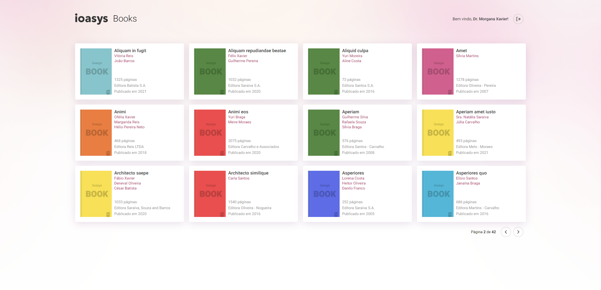

<h1 align="center">
    
</h1>

<br>

## 📚 Ioasys Books

Ioasys Books é uma aplicação, onde você consegue visualizar uma coletânea de livros e suas informações.
- Efetuar login para acessar a coletânea de livros.
- Visualizar informações de cada livro.
- Exibição de mensagens de erro;
- Entre outros.

## 🛠 Tecnologias

Esse projeto foi desenvolvido com as seguintes tecnologias:

- ReactJS
- Typescript
- React-Router-dom
- Axios
- Unform
- Yup
- Styled-components
- React-icons
- React-spinner
- React-toastify
- ESLint
- Prettier

## 🚀 Como executar

Clone o projeto e acesse a pasta do mesmo.

```bash
$ git clone git@github.com:luizsmatos/books.git

$ cd books
```

Para iniciá-lo, siga os passos abaixo:
```bash
# Instalar as dependências
$ yarn ou npm install

# Iniciar o projeto
$ yarn start ou npm start
```

---
